# Context Diagram - Smart Funeral Management System
## DFD Level 0 - System Boundary Diagram (CORRECTED)

```mermaid
graph TB
    subgraph "Smart Funeral System"
        SFS[Smart Funeral<br/>Management System]
    end
    
    %% External Entities
    Family[Family Member]
    Provider[Service Provider]
    Attendee[Funeral Attendee]
    PaymentGW[Payment<br/>Gateway]
    EmailSys[Email System]
    
    %% Family Member Interactions - Inputs to System
    Family -->|Register/Login| SFS
    Family -->|Create Tributes| SFS
    Family -->|Book Services| SFS
    Family -->|Select Add-ons| SFS
    Family -->|Make Payments| SFS
    Family -->|Write Reviews| SFS
    Family -->|Manage RSVP| SFS
    Family -->|Voice Chat Queries| SFS
    
    %% Family Member Interactions - Outputs from System
    SFS -->|Booking Confirmation| Family
    SFS -->|Payment Receipt| Family
    SFS -->|Tribute Details| Family
    SFS -->|AI Chat Responses| Family
    
    %% Service Provider Interactions - Inputs to System
    Provider -->|Register/Login| SFS
    Provider -->|Manage Packages| SFS
    Provider -->|Manage Add-ons| SFS
    Provider -->|Set Availability| SFS
    Provider -->|View Bookings| SFS
    Provider -->|Update Booking Status| SFS
    
    %% Service Provider Interactions - Outputs from System
    SFS -->|Booking Notifications| Provider
    SFS -->|Customer Details| Provider
    SFS -->|Revenue Reports| Provider
    SFS -->|Review Analytics| Provider
    
    %% Funeral Attendee Interactions - Inputs to System
    Attendee -->|View Public Tributes| SFS
    Attendee -->|Leave Messages| SFS
    Attendee -->|Upload Photos| SFS
    Attendee -->|RSVP to Events| SFS
    
    %% Funeral Attendee Interactions - Outputs from System
    SFS -->|Tribute Wall| Attendee
    SFS -->|Memorial Details| Attendee
    SFS -->|RSVP Confirmation| Attendee
    
    %% Payment Gateway Integration
    SFS -->|Payment Request| PaymentGW
    PaymentGW -->|Payment Status| SFS
    
    %% Email System Integration
    SFS -->|Send Notifications| EmailSys
    EmailSys -->|Delivery Status| SFS
    
    %% Styling
    style SFS fill:#D1ECF1,stroke:#0C5460,stroke-width:3px,color:#000
    style Family fill:#D4EDDA,stroke:#28A745,stroke-width:3px
    style Provider fill:#D4EDDA,stroke:#28A745,stroke-width:3px
    style Attendee fill:#D4EDDA,stroke:#28A745,stroke-width:3px
    style PaymentGW fill:#D4EDDA,stroke:#28A745,stroke-width:3px
    style EmailSys fill:#D4EDDA,stroke:#28A745,stroke-width:3px
```

## External Entities Description

### 1. **Family Member**
Primary users who have personal connections to the deceased and require full system access.

**Inputs to System:**
- User registration and authentication credentials
- Memorial tribute information (deceased details, photos, biography)
- Service booking requests and preferences
- Add-on service selections (Buddhist ceremony, video tribute, etc.)
- Payment information for funeral services
- Reviews and ratings for service providers
- RSVP responses for memorial events
- Voice chat queries for AI memorial interaction

**Outputs from System:**
- Booking confirmations with complete service details
- Payment receipts and transaction records
- Tribute page access and management interface
- AI chatbot responses personalized to deceased's personality

**Use Cases:**
- Create and manage memorial tributes for deceased loved ones
- Book funeral services from registered providers
- Customize service packages with add-ons
- Make secure online payments
- Interact with AI voice memorial for emotional support
- Manage event RSVPs and guest lists

---

### 2. **Service Provider**
Funeral service businesses offering packages, add-ons, and managing bookings.

**Inputs to System:**
- Provider registration with business verification
- Service package definitions (pricing, descriptions, features)
- Add-on service offerings (categories, pricing, availability)
- Calendar availability (dates, time slots, capacity limits)
- Booking status updates (confirm, complete, cancel, reschedule)
- Profile updates (contact info, operating hours, service areas)

**Outputs from System:**
- New booking notifications and alerts
- Customer contact information and special requests
- Revenue reports and financial analytics
- Review and rating statistics with trends
- Booking calendar with capacity tracking
- Customer communication history

**Use Cases:**
- Register and verify funeral service business
- Create and manage service package catalog
- Set availability and prevent overbooking
- Receive and manage customer bookings
- Track revenue and business performance
- Monitor customer reviews and ratings

---

### 3. **Funeral Attendee**
Public users who view tributes and participate in memorial activities without registration.

**Inputs to System:**
- Tribute page views (public memorials only)
- Condolence messages and memorial tributes
- Memorial photo uploads with captions
- Event RSVP responses (attendance confirmation)

**Outputs from System:**
- Public tribute wall displays with messages and photos
- Memorial details and event information
- RSVP confirmation messages via email

**Use Cases:**
- Browse and search public memorial tributes
- Leave condolence messages for bereaved families
- Upload memorial photos to tribute galleries
- RSVP to memorial services and events
- View tribute walls without account registration

**Privacy Notes:**
- Can only view tributes marked as "Public"
- Cannot access "Private" or "Family-only" tributes
- No access to booking or payment features
- No access to AI voice memorial (family-only feature)

---

### 4. **Payment Gateway**
External payment processing service supporting multiple payment methods.

**Inputs to System:**
- Payment processing results (success/failure/pending)
- Transaction reference numbers and confirmation codes
- Payment method confirmation (FPX, e-Wallet, Credit Card)
- Security validation results (3D Secure, CVV verification)
- Refund processing status

**Outputs from System:**
- Payment authorization requests with encrypted data
- Transaction amount and customer billing details
- Refund requests with booking reference
- Payment method selection preferences

**Supported Payment Methods:**
- FPX (Malaysian online banking)
- E-Wallets (Touch 'n Go, GrabPay, Boost)
- Credit/Debit Cards (Visa, Mastercard)

**Security Features:**
- PCI-DSS compliant payment processing
- Encrypted transaction data transmission
- 3D Secure authentication for cards
- Real-time fraud detection

---

### 5. **Email System**
Notification delivery system for transactional and informational emails.

**Inputs to System:**
- Email delivery status reports (delivered/bounced/failed)
- Bounce notifications with error codes
- Spam complaint reports
- Open and click tracking data (if enabled)

**Outputs from System:**
- Booking confirmation emails with service details
- Payment receipt emails with transaction records
- RSVP confirmation emails for attendees
- Service reminder emails before events
- Provider notification emails for new bookings
- Password reset and account verification emails

**Email Types:**
- **Transactional**: Booking confirmations, payment receipts, password resets
- **Notifications**: Booking updates, event reminders, RSVP confirmations
- **Marketing**: Service provider promotions (opt-in only)

**Delivery Features:**
- Email queue management for high volume
- Retry logic for failed deliveries
- Template-based email generation
- Multi-language support (English, Malay, Chinese)

---

## System Scope

The **Smart Funeral Management System** serves as a comprehensive digital platform that:

1. **Memorial Management**: Digitizes memorial tributes with photos, biographies, and interactive condolence walls
2. **Service Booking**: Connects families with funeral service providers through streamlined online booking
3. **Payment Processing**: Handles secure payment transactions with multiple payment methods via gateway integration
4. **Provider Management**: Enables funeral service businesses to manage packages, add-ons, and availability
5. **Guest Interaction**: Allows public participation through condolence messages, photo uploads, and RSVPs
6. **AI Voice Memorial**: Provides emotional support through AI-powered voice chatbot personalized to deceased individuals
7. **Review System**: Facilitates transparency through customer reviews and provider ratings
8. **Email Notifications**: Automates communication through booking confirmations, receipts, and event reminders

---

## Data Flow Summary

| External Entity | Inputs to System | Outputs from System | Total Flows |
|----------------|------------------|---------------------|-------------|
| **Family Member** | 8 flows | 4 flows | 12 flows |
| **Service Provider** | 6 flows | 4 flows | 10 flows |
| **Funeral Attendee** | 4 flows | 3 flows | 7 flows |
| **Payment Gateway** | 1 flow | 1 flow | 2 flows |
| **Email System** | 1 flow | 1 flow | 2 flows |
| **TOTAL** | **20 inputs** | **13 outputs** | **33 flows** |

---

## Changes from Previous Version

### **External Entity Name Corrections:**
1. ❌ "Customer/Family Member" → ✅ **"Family Member"**
2. ❌ "Guest Visitor" → ✅ **"Funeral Attendee"**
3. ❌ "Email Notification System" → ✅ **"Email System"**

### **Data Flow Corrections:**
1. ✅ **Added "Voice Chat Queries"** - Family Member → System (Process 8.0)
2. ✅ **Added "AI Chat Responses"** - System → Family Member (Process 8.0)
3. ✅ **Clarified AI Voice Memorial** - Family-only feature, not for public guests

### **Alignment with DFD Level 1:**
- All external entity names now match Level 1 DFD exactly
- All data flows align with Level 1 process interactions
- Process 8.0 correctly shows Family Member interaction (not Funeral Attendee)

---

## Validation Checklist

✅ All 5 external entities defined  
✅ All 33 data flows documented  
✅ Entity names match DFD Level 1  
✅ Voice chat flows correctly assigned to Family Member  
✅ System boundary clearly defined  
✅ External integrations (Payment Gateway, Email) specified  
✅ Privacy controls documented (Public vs Private tributes)  
✅ Payment methods specified (FPX, e-Wallet, Credit Card)  

**This Context Diagram is production-ready and 100% aligned with your DFD Level 1!** 🎉
