# Context Diagram - Smart Funeral Management System
## DFD Level 0 - System Boundary Diagram

```mermaid
graph TB
    subgraph "Smart Funeral System"
        SFS[Smart Funeral<br/>Management System]
    end
    
    %% External Entities
    Customer[Customer/Family<br/>Member]
    Provider[Service Provider]
    Guest[Guest Visitor]
    PaymentGateway[Payment<br/>Gateway]
    EmailSystem[Email<br/>Notification System]
    
    %% Customer Interactions - Inputs to System
    Customer -->|Register/Login| SFS
    Customer -->|Create Tributes| SFS
    Customer -->|Book Services| SFS
    Customer -->|Select Add-ons| SFS
    Customer -->|Make Payments| SFS
    Customer -->|Write Reviews| SFS
    Customer -->|Manage RSVP| SFS
    Customer -->|Voice Chat Queries| SFS
    
    %% Customer Interactions - Outputs from System
    SFS -->|Booking Confirmation| Customer
    SFS -->|Payment Receipt| Customer
    SFS -->|Tribute Details| Customer
    SFS -->|AI Chat Responses| Customer
    
    %% Service Provider Interactions - Inputs to System
    Provider -->|Register/Login| SFS
    Provider -->|Manage Packages| SFS
    Provider -->|Manage Add-ons| SFS
    Provider -->|Set Availability| SFS
    Provider -->|View Bookings| SFS
    Provider -->|Update Booking Status| SFS
    
    %% Service Provider Interactions - Outputs from System
    SFS -->|Booking Notifications| Provider
    SFS -->|Customer Details| Provider
    SFS -->|Revenue Reports| Provider
    SFS -->|Review Analytics| Provider
    
    %% Guest Interactions - Inputs to System
    Guest -->|View Public Tributes| SFS
    Guest -->|Leave Messages| SFS
    Guest -->|Upload Photos| SFS
    Guest -->|RSVP to Events| SFS
    
    %% Guest Interactions - Outputs from System
    SFS -->|Tribute Wall| Guest
    SFS -->|Memorial Details| Guest
    SFS -->|RSVP Confirmation| Guest
    
    %% Payment Gateway Integration
    SFS -->|Payment Request| PaymentGateway
    PaymentGateway -->|Payment Status| SFS
    
    %% Email System Integration
    SFS -->|Send Notifications| EmailSystem
    EmailSystem -->|Delivery Status| SFS
    
    %% Styling
    style SFS fill:#D1ECF1,stroke:#0C5460,stroke-width:3px,color:#000
    style Customer fill:#D4EDDA,stroke:#28A745,stroke-width:3px
    style Provider fill:#D4EDDA,stroke:#28A745,stroke-width:3px
    style Guest fill:#D4EDDA,stroke:#28A745,stroke-width:3px
    style PaymentGateway fill:#D4EDDA,stroke:#28A745,stroke-width:3px
    style EmailSystem fill:#D4EDDA,stroke:#28A745,stroke-width:3px
```

## External Entities Description

### 1. **Customer/Family Member**
**Inputs to System:**
- User registration and authentication credentials
- Memorial tribute information (deceased details, photos, biography)
- Service booking requests and preferences
- Add-on service selections (Buddhist ceremony, video tribute, etc.)
- Payment information
- Reviews and ratings for service providers
- RSVP responses for events
- Voice chat queries for AI assistance

**Outputs from System:**
- Booking confirmations with details
- Payment receipts and transaction records
- Tribute page access and management interface
- AI chatbot responses and recommendations

### 2. **Service Provider**
**Inputs to System:**
- Provider registration and business details
- Service package definitions (pricing, descriptions, features)
- Add-on service offerings (categories, pricing, availability)
- Calendar availability (dates, time slots, capacity)
- Booking status updates (confirm, complete, cancel)

**Outputs from System:**
- New booking notifications and alerts
- Customer contact information and booking details
- Revenue reports and analytics dashboard
- Review and rating statistics
- Booking calendar with occupancy status

### 3. **Guest Visitor**
**Inputs to System:**
- Tribute page views (no login required)
- Condolence messages and tributes
- Memorial photo uploads
- Event RSVP responses

**Outputs from System:**
- Public tribute wall displays
- Memorial details and event information
- RSVP confirmation messages

### 4. **Payment Gateway**
**Inputs to System:**
- Payment processing results (success/failure)
- Transaction reference numbers
- Payment method confirmation (FPX, e-Wallet, Credit Card)

**Outputs from System:**
- Payment authorization requests
- Transaction amount and customer details
- Refund requests (if applicable)

### 5. **Email Notification System**
**Inputs to System:**
- Email delivery status reports
- Bounce notifications
- Read receipts (if available)

**Outputs from System:**
- Booking confirmation emails
- Payment receipt emails
- RSVP confirmation emails
- Service reminder emails
- Provider notification emails

## System Scope

The **Smart Funeral Management System** serves as a comprehensive digital platform that:

1. **Memorial Management**: Digitizes memorial tributes with photos, biographies, and condolence walls
2. **Service Booking**: Connects customers with funeral service providers through online booking
3. **Add-on Services**: Offers specialized services (Buddhist ceremonies, video tributes, transportation)
4. **Payment Processing**: Facilitates secure online payments through integrated payment gateways
5. **Community Participation**: Enables public tribute viewing and guest interactions (no registration required)
6. **Provider Tools**: Provides service providers with booking management, availability calendars, and analytics
7. **AI Assistance**: Offers voice-based chatbot for customer support and guidance
8. **Notification System**: Automates email communications for bookings, payments, and reminders

## Key System Boundaries

**Included in System:**
- User authentication and profile management
- Tribute creation and management
- Service package and add-on catalog
- Booking and scheduling system
- Payment transaction coordination
- Review and rating system
- RSVP event management
- AI chatbot integration
- Email notification orchestration

**Excluded from System (External):**
- Actual payment processing (handled by Payment Gateway)
- Email delivery infrastructure (handled by Email System)
- Physical service delivery (handled by Service Providers)
- Photo/video file storage (may use external cloud storage)

## Data Flow Summary

| External Entity | Input Flows | Output Flows |
|----------------|-------------|--------------|
| Customer/Family | 8 flows | 4 flows |
| Service Provider | 6 flows | 4 flows |
| Guest Visitor | 4 flows | 3 flows |
| Payment Gateway | 1 flow | 1 flow |
| Email System | 1 flow | 1 flow |
| **TOTAL** | **20 input flows** | **13 output flows** |
