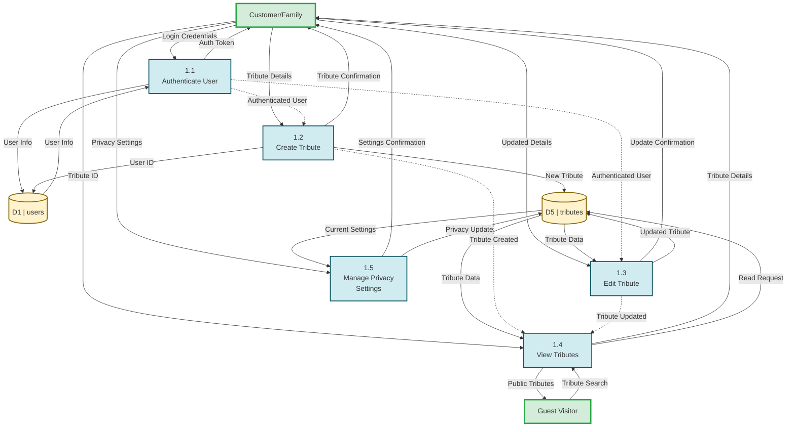
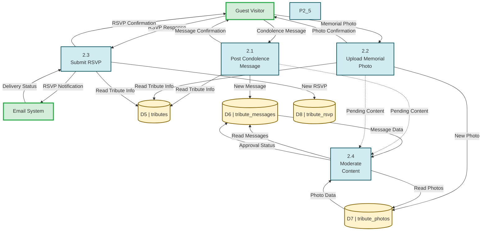
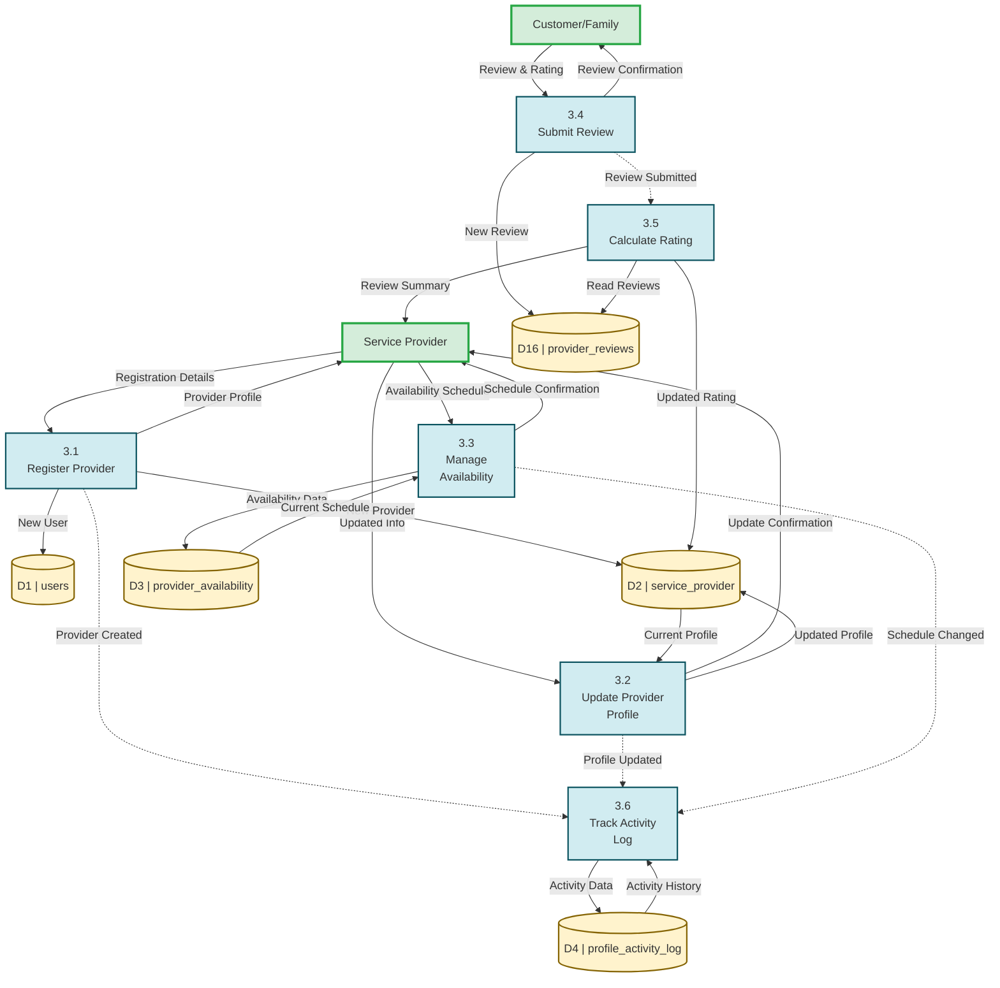
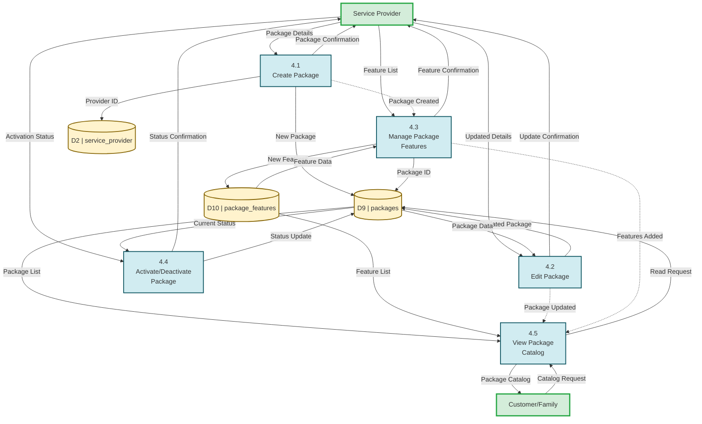
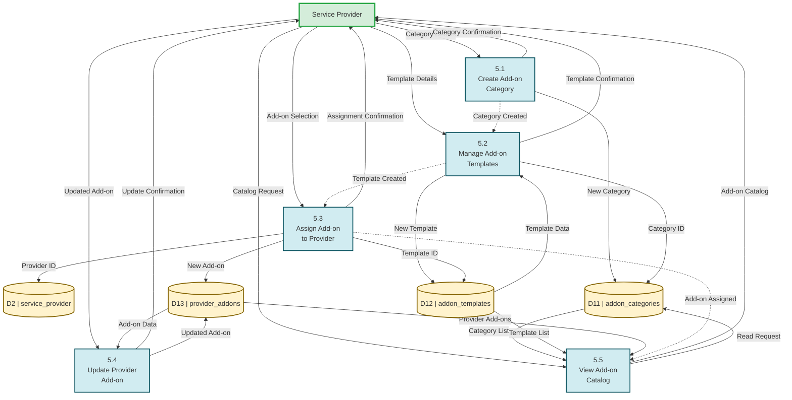
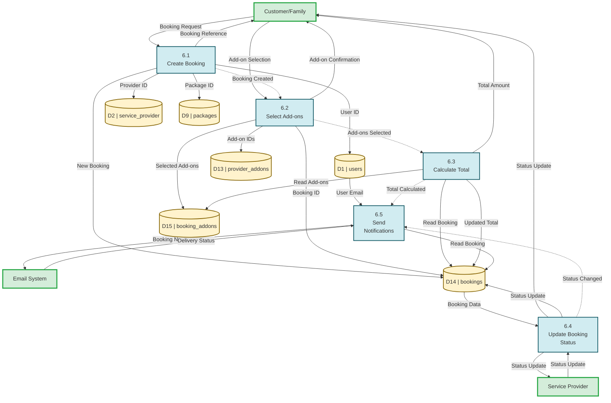
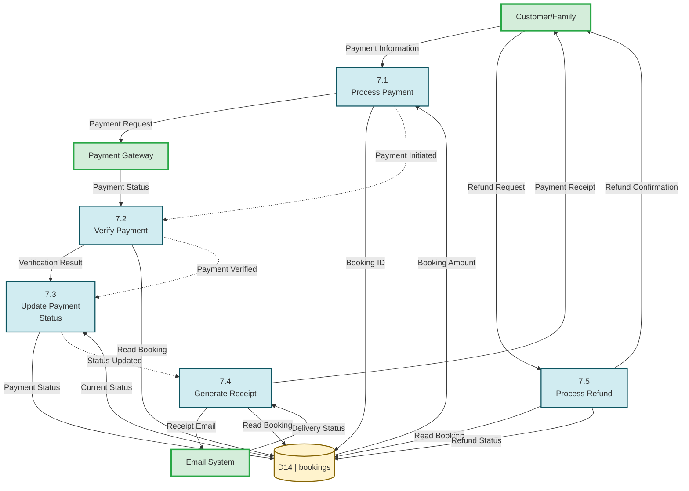
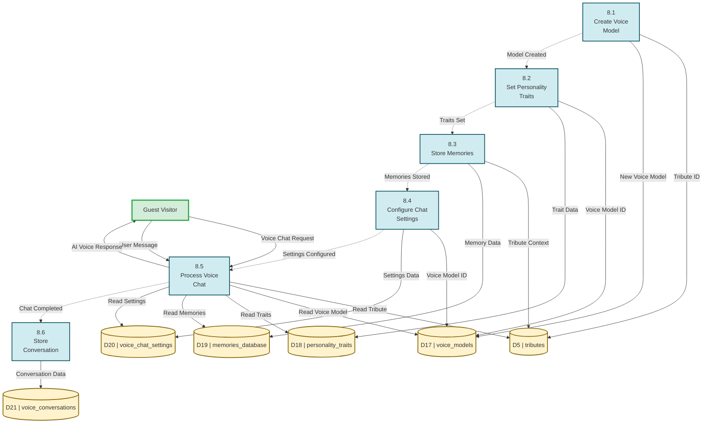

# DFD Level 2 - Complete Guide
## Smart Funeral Management System
### All 8 Processes Decomposed

**Date:** November 1, 2025

---

## Overview

This guide provides DFD Level 2 diagrams for all 8 processes from Level 1. Each Level 2 diagram shows the detailed sub-processes within each main process.

**Structure:**
- Each Level 1 process (P1.0 - P8.0) gets its own Level 2 diagram
- Sub-processes are numbered: P1.1, P1.2, P1.3, etc.
- Same data stores from Level 1 are used
- Same external entities connect to relevant sub-processes

---

## Table of Contents

1. [DFD Level 2 - Process 1.0: Manage Memorial Tributes](#process-10)
2. [DFD Level 2 - Process 2.0: Manage Tribute Wall & Interactions](#process-20)
3. [DFD Level 2 - Process 3.0: Manage Service Providers & Reviews](#process-30)
4. [DFD Level 2 - Process 4.0: Manage Service Packages & Features](#process-40)
5. [DFD Level 2 - Process 5.0: Manage Add-on Catalog & Provider Add-ons](#process-50)
6. [DFD Level 2 - Process 6.0: Manage Funeral Service Bookings](#process-60)
7. [DFD Level 2 - Process 7.0: Manage Payments & Refunds](#process-70)
8. [DFD Level 2 - Process 8.0: Manage AI Voice Memorial](#process-80)

---

## 1. DFD Level 2 - Process 1.0: Manage Memorial Tributes

### Sub-Processes:

**P1.1** - Authenticate User  
**P1.2** - Create Tribute  
**P1.3** - Edit Tribute  
**P1.4** - View Tributes  
**P1.5** - Manage Privacy Settings  

### External Entities:
- Customer/Family
- Guest Visitor

### Data Stores:
- D1: users
- D5: tributes

### Mermaid Code:

### Lucidchart Instructions:

1. **Title:** "DFD Level 2 - Process 1.0: Manage Memorial Tributes"
2. **External Entities:** Customer/Family (left), Guest Visitor (right)
3. **Sub-Processes:** Draw 5 rounded rectangles labeled 1.1 through 1.5
4. **Data Stores:** D1 (users), D5 (tributes)
5. **Flows:** Follow the arrows from Mermaid code above

---

## 2. DFD Level 2 - Process 2.0: Manage Tribute Wall & Interactions

### Sub-Processes:

**P2.1** - Post Condolence Message  
**P2.2** - Upload Memorial Photo  
**P2.3** - Submit RSVP  
**P2.4** - Moderate Content  

### External Entities:
- Guest Visitor
- Email System

### Data Stores:
- D5: tributes
- D6: tribute_messages
- D7: tribute_photos
- D8: tribute_rsvp

### Mermaid Code:

---

## 3. DFD Level 2 - Process 3.0: Manage Service Providers & Reviews

### Sub-Processes:

**P3.1** - Register Provider  
**P3.2** - Update Provider Profile  
**P3.3** - Manage Availability  
**P3.4** - Submit Review  
**P3.5** - Calculate Rating  
**P3.6** - Track Activity Log  

### External Entities:
- Service Provider
- Customer/Family

### Data Stores:
- D1: users
- D2: service_provider
- D3: provider_availability
- D4: profile_activity_log
- D16: provider_reviews

### Mermaid Code:

---

## 4. DFD Level 2 - Process 4.0: Manage Service Packages & Features

### Sub-Processes:

**P4.1** - Create Package  
**P4.2** - Edit Package  
**P4.3** - Manage Package Features  
**P4.4** - Activate/Deactivate Package  
**P4.5** - View Package Catalog  

### External Entities:
- Service Provider
- Customer/Family

### Data Stores:
- D2: service_provider
- D9: packages
- D10: package_features

### Mermaid Code:

---

## 5. DFD Level 2 - Process 5.0: Manage Add-on Catalog & Provider Add-ons

### Sub-Processes:

**P5.1** - Create Add-on Category  
**P5.2** - Manage Add-on Templates  
**P5.3** - Assign Add-on to Provider  
**P5.4** - Update Provider Add-on  
**P5.5** - View Add-on Catalog  

### External Entities:
- Service Provider

### Data Stores:
- D2: service_provider
- D11: addon_categories
- D12: addon_templates
- D13: provider_addons

### Mermaid Code:

---

## 6. DFD Level 2 - Process 6.0: Manage Funeral Service Bookings

### Sub-Processes:

**P6.1** - Create Booking  
**P6.2** - Select Add-ons  
**P6.3** - Calculate Total  
**P6.4** - Update Booking Status  
**P6.5** - Send Notifications  

### External Entities:
- Customer/Family
- Service Provider
- Email System

### Data Stores:
- D1: users
- D2: service_provider
- D9: packages
- D13: provider_addons
- D14: bookings
- D15: booking_addons

### Mermaid Code:

---

## 7. DFD Level 2 - Process 7.0: Manage Payments & Refunds

### Sub-Processes:

**P7.1** - Process Payment  
**P7.2** - Verify Payment  
**P7.3** - Update Payment Status  
**P7.4** - Generate Receipt  
**P7.5** - Process Refund  

### External Entities:
- Customer/Family
- Payment Gateway
- Email System

### Data Stores:
- D14: bookings

### Mermaid Code:

---

## 8. DFD Level 2 - Process 8.0: Manage AI Voice Memorial

### Sub-Processes:

**P8.1** - Create Voice Model  
**P8.2** - Set Personality Traits  
**P8.3** - Store Memories  
**P8.4** - Configure Chat Settings  
**P8.5** - Process Voice Chat  
**P8.6** - Store Conversation  

### External Entities:
- Guest Visitor

### Data Stores:
- D5: tributes
- D17: voice_models
- D18: personality_traits
- D19: memories_database
- D20: voice_chat_settings
- D21: voice_conversations

### Mermaid Code:

---

## General Guidelines for Drawing DFD Level 2

### Layout Tips:

1. **Sub-process arrangement:**
   - Arrange in logical flow order (left to right, top to bottom)
   - Group related sub-processes close together

2. **Data stores:**
   - Place near the sub-processes that use them most
   - Can be repeated if used by multiple sub-processes

3. **External entities:**
   - Keep same positions as Level 1
   - Only show entities that interact with this process

4. **Arrows:**
   - Use solid arrows for data flows
   - Use dotted arrows for inter-sub-process flows
   - Label every arrow clearly

### Color Coding:

- **External Entities:** Light Green (#D4EDDA), Border: Dark Green (#28A745)
- **Sub-Processes:** Light Blue (#D1ECF1), Border: Dark Blue (#0C5460)
- **Data Stores:** Light Yellow (#FFF3CD), Border: Dark Yellow (#856404)

### Numbering Convention:

- Process 1.0 → Sub-processes: 1.1, 1.2, 1.3, 1.4, 1.5
- Process 2.0 → Sub-processes: 2.1, 2.2, 2.3, 2.4, 2.5
- And so on...

---

## Summary

You now have 8 complete DFD Level 2 diagrams, one for each Level 1 process:

1. ✅ **P1.0** - 5 sub-processes (Manage Memorial Tributes)
2. ✅ **P2.0** - 4 sub-processes (Manage Tribute Wall & Interactions) - **Candle feature removed**
3. ✅ **P3.0** - 6 sub-processes (Manage Service Providers & Reviews)
4. ✅ **P4.0** - 5 sub-processes (Manage Service Packages & Features)
5. ✅ **P5.0** - 5 sub-processes (Manage Add-on Catalog & Provider Add-ons)
6. ✅ **P6.0** - 5 sub-processes (Manage Funeral Service Bookings)
7. ✅ **P7.0** - 5 sub-processes (Manage Payments & Refunds)
8. ✅ **P8.0** - 6 sub-processes (Manage AI Voice Memorial)

**Total Sub-Processes:** 41

Each diagram can be drawn in Lucidchart using the same techniques from the Level 1 guide, just with sub-processes instead of main processes.

---

**Good luck with your DFD Level 2 diagrams! 🎨**
