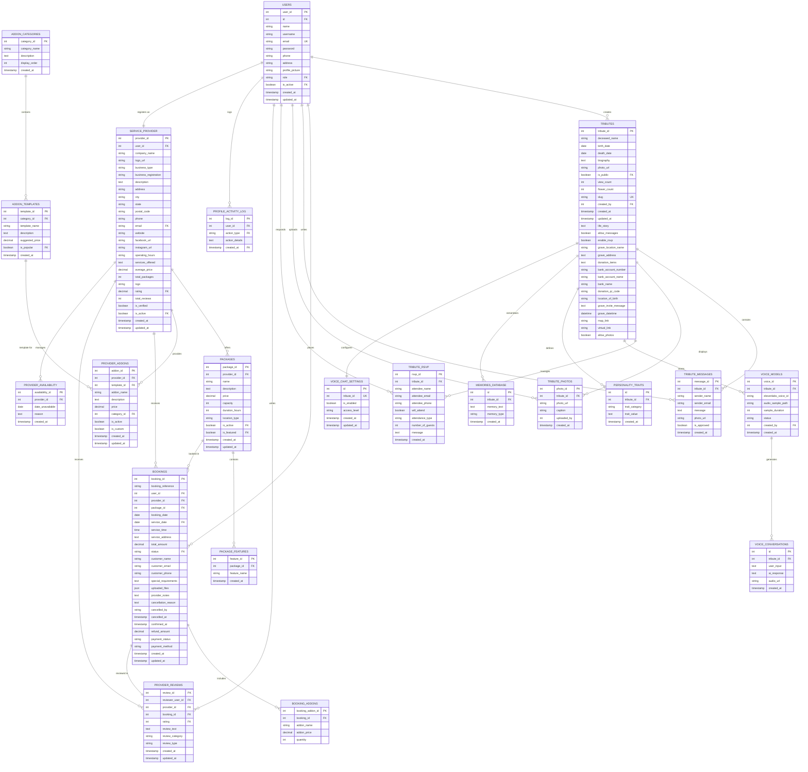

# Entity Relationship Diagram (ERD) - Smart Funeral System

## Complete Database Schema

## Key Relationships

### User Management
- **USERS** (1) → (M) **TRIBUTES**: One user can create multiple tributes
- **USERS** (1) → (M) **BOOKINGS**: One user can make multiple bookings
- **USERS** (1) → (M) **PROVIDER_REVIEWS**: One user can write multiple reviews
- **USERS** (1) → (M) **TRIBUTE_MESSAGES/PHOTOS**: One user can interact with tributes
- **USERS** (1) → (M) **PROFILE_ACTIVITY_LOG**: One user has multiple activity logs
- **USERS** (1) → (1) **SERVICE_PROVIDER**: One user can register as one service provider

### Service Provider System
- **SERVICE_PROVIDER** (1) → (M) **PACKAGES**: One provider offers multiple packages
- **SERVICE_PROVIDER** (1) → (M) **PROVIDER_ADDONS**: One provider provides multiple add-ons
- **SERVICE_PROVIDER** (1) → (M) **BOOKINGS**: One provider receives multiple bookings
- **SERVICE_PROVIDER** (1) → (M) **PROVIDER_REVIEWS**: One provider receives multiple reviews
- **SERVICE_PROVIDER** (1) → (M) **PROVIDER_AVAILABILITY**: One provider manages availability dates

### Add-on System
- **ADDON_CATEGORIES** (1) → (M) **ADDON_TEMPLATES**: One category contains multiple templates
- **ADDON_TEMPLATES** (1) → (M) **PROVIDER_ADDONS**: One template can be used by multiple providers
- **ADDON_CATEGORIES** (1) → (M) **PROVIDER_ADDONS**: One category organizes multiple provider add-ons

### Booking System
- **PACKAGES** (1) → (M) **PACKAGE_FEATURES**: One package has multiple features
- **PACKAGES** (1) → (M) **BOOKINGS**: One package can be booked multiple times
- **BOOKINGS** (1) → (M) **BOOKING_ADDONS**: One booking includes multiple add-ons
- **BOOKINGS** (1) → (1) **PROVIDER_REVIEWS**: One booking can have one review

### Tribute System
- **TRIBUTES** (1) → (M) **TRIBUTE_MESSAGES**: One tribute has multiple condolence messages (tribute wall)
- **TRIBUTES** (1) → (M) **TRIBUTE_PHOTOS**: One tribute displays multiple memorial photos
- **TRIBUTES** (1) → (M) **TRIBUTE_RSVP**: One tribute manages multiple RSVP responses for funeral events

### Voice Memory AI System
- **TRIBUTES** (1) → (M) **VOICE_MODELS**: One tribute can have multiple voice models
- **TRIBUTES** (1) → (M) **PERSONALITY_TRAITS**: One tribute defines personality characteristics
- **TRIBUTES** (1) → (M) **MEMORIES_DATABASE**: One tribute stores multiple memories for AI context
- **TRIBUTES** (1) → (1) **VOICE_CHAT_SETTINGS**: One tribute has one voice chat configuration
- **VOICE_MODELS** (1) → (M) **VOICE_CONVERSATIONS**: One voice model generates multiple conversations

## Data Integrity Rules

1. **Cascading Deletes**: Deleting a tribute removes all associated messages, photos, RSVPs, voice models, and memories
2. **Soft Deletes**: Users and service providers use status flags instead of hard deletes  
3. **Unique Constraints**: Email (users), slug (tributes), booking_reference (bookings)
4. **Foreign Key Constraints**: All relationships enforce referential integrity
5. **Check Constraints**: Rating (1-5), status enums, boolean flags

## Database Summary

**Total Tables: 21**

### Core System (5 tables):
- users, service_provider, profile_activity_log, provider_availability, tributes

### Booking System (5 tables):
- packages, package_features, bookings, booking_addons, provider_reviews

### Add-on System (3 tables):
- addon_categories, addon_templates, provider_addons

### Tribute Features (3 tables):
- tribute_messages, tribute_photos, tribute_rsvp

### Voice AI System (5 tables):
- voice_models, personality_traits, memories_database, voice_chat_settings, voice_conversations

## Note on Features

- **Virtual Candles**: The `allow_candles` field exists in tributes table but no tribute_candles table - feature not implemented
- **Voice AI**: Full implementation with 5 tables for ElevenLabs voice cloning and AI personality
- **Add-on Templates**: Providers can create add-ons from predefined templates in 9 categories
- **Provider Availability**: Providers can mark dates as unavailable for bookings
