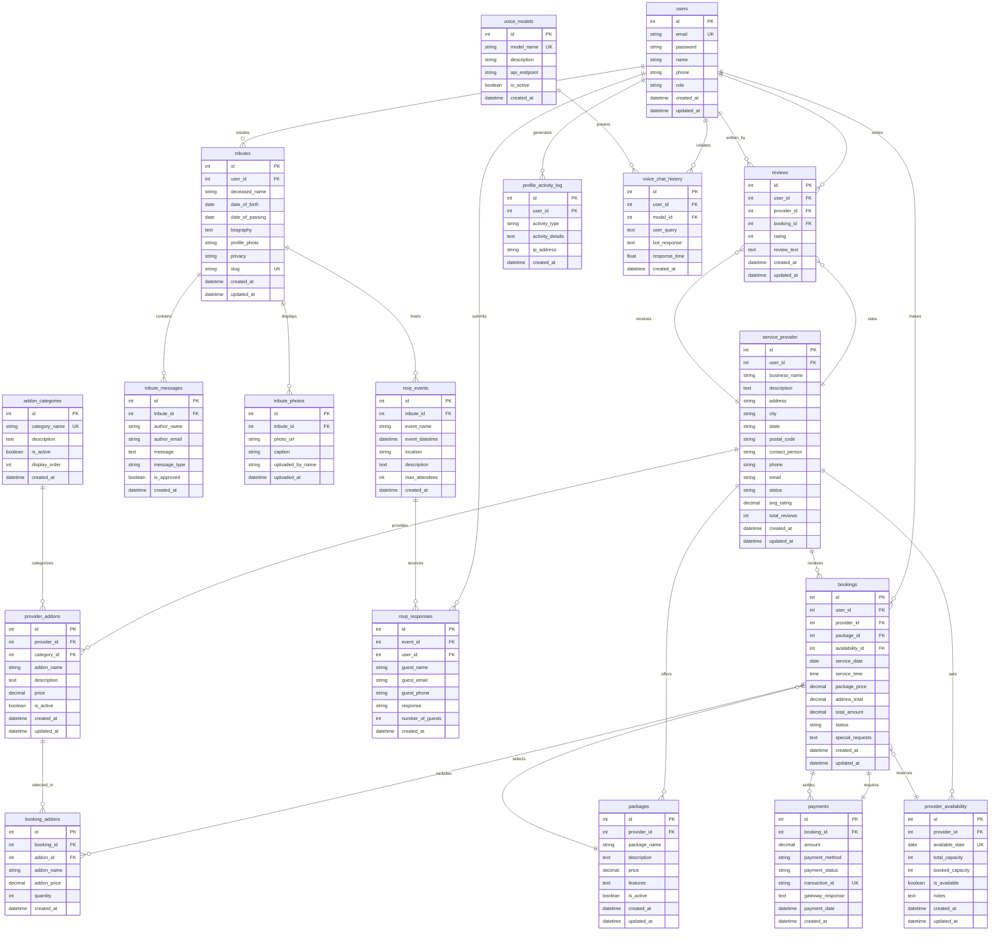

# Entity Relationship Diagram - Smart Funeral Management System
## Complete Database Schema

## Table Descriptions

### Core User Management

#### 1. **users**
- Primary user account table for all system users
- Supports multiple roles: customer, provider, admin
- Email is unique identifier for authentication
- Stores basic profile information

#### 2. **profile_activity_log**
- Tracks user activities for security and analytics
- Records login attempts, profile changes, bookings, reviews
- Stores IP address for security auditing

### Service Provider Management

#### 3. **service_provider**
- Extended profile for funeral service providers
- Links to users table (one-to-one relationship)
- Stores business information and verification status
- Caches average rating and review count for performance

#### 4. **packages**
- Service packages offered by providers
- Contains pricing, features, and descriptions
- Can be activated/deactivated by provider

#### 5. **provider_addons**
- Additional services offered by providers
- Categorized by addon_categories (Buddhist ceremony, video tribute, etc.)
- Flexible pricing and availability control

#### 6. **addon_categories**
- System-wide add-on categories
- Defines available service types (transportation, ceremony, media, etc.)
- Display order controls UI presentation

#### 7. **provider_availability**
- Calendar-based availability management
- Tracks total capacity and booked slots per date
- Prevents overbooking through capacity checks

### Memorial Tribute System

#### 8. **tributes**
- Memorial pages for deceased individuals
- Privacy controls (public, private, family_only)
- Unique slug for friendly URLs
- Links to user who created the tribute

#### 9. **tribute_messages**
- Condolence messages on tribute wall
- Supports different message types (condolence, memory, prayer)
- Moderation through is_approved flag
- Can be from guests (no user_id required)

#### 10. **tribute_photos**
- Memorial photo gallery
- Stores photo URLs (files stored separately)
- Caption and uploader information
- Public or private based on tribute privacy

### Event Management

#### 11. **rsvp_events**
- Funeral/memorial events linked to tributes
- Date, time, location information
- Optional max attendee limit

#### 12. **rsvp_responses**
- Attendance responses from users or guests
- Supports guest RSVPs (no login required)
- Tracks number of additional guests
- Response options: attending, not_attending, maybe

### Booking & Payment System

#### 13. **bookings**
- Core booking entity linking customers and providers
- References package, availability, and user
- Stores pricing snapshot (package + addons)
- Status workflow: pending → confirmed → completed/cancelled

#### 14. **booking_addons**
- Junction table for booking and provider_addons
- Stores snapshot of addon details at booking time
- Supports quantity for addons (e.g., 3 transportation vehicles)

#### 15. **payments**
- Payment transaction records
- Links to single booking (one-to-one)
- Stores payment method and status
- Transaction ID for gateway reconciliation
- Gateway response for debugging

### Review System

#### 16. **reviews**
- Customer reviews for service providers
- Rating scale: 1-5 stars
- Optional booking reference
- Linked to user for accountability

### AI Voice Chatbot

#### 17. **voice_models**
- Available AI voice models (e.g., Gemini, GPT)
- API endpoint configuration
- Can activate/deactivate models

#### 18. **voice_chat_history**
- Conversation logs for AI chatbot
- Stores user queries and bot responses
- Performance tracking (response_time)
- Supports guest chats (no user_id)

## Key Relationships Summary

| Relationship | Cardinality | Description |
|-------------|-------------|-------------|
| users → tributes | 1:N | One user creates many tributes |
| users → bookings | 1:N | One user makes many bookings |
| service_provider → packages | 1:N | One provider offers many packages |
| service_provider → provider_availability | 1:N | One provider has many availability dates |
| tributes → tribute_messages | 1:N | One tribute has many messages |
| tributes → rsvp_events | 1:N | One tribute hosts many events |
| bookings → booking_addons | 1:N | One booking includes many addons |
| bookings → payments | 1:1 | One booking has one payment |
| addon_categories → provider_addons | 1:N | One category contains many addons |
| rsvp_events → rsvp_responses | 1:N | One event receives many responses |

## Data Integrity Rules

1. **Foreign Key Constraints:**
   - All FK relationships enforce referential integrity
   - CASCADE on delete for dependent records (e.g., tribute_messages when tribute deleted)
   - RESTRICT on delete for critical records (e.g., cannot delete user with active bookings)

2. **Unique Constraints:**
   - `users.email` - One account per email address
   - `tributes.slug` - Unique URLs for tribute pages
   - `addon_categories.category_name` - Prevents duplicate categories
   - `payments.transaction_id` - Prevents duplicate payment processing
   - `provider_availability(provider_id, available_date)` - One availability record per provider per date

3. **Check Constraints:**
   - `reviews.rating` BETWEEN 1 AND 5
   - `provider_availability.booked_capacity` <= `total_capacity`
   - `bookings.total_amount` = `package_price` + `addons_total`
   - `rsvp_responses.number_of_guests` >= 1

4. **Nullable Fields:**
   - `voice_chat_history.user_id` - Allows guest chats
   - `rsvp_responses.user_id` - Allows guest RSVPs
   - `reviews.booking_id` - Reviews not tied to bookings (walk-in customers)

## Total Tables: 21

**Core System:** 2 tables (users, profile_activity_log)  
**Provider Management:** 5 tables (service_provider, packages, addon_categories, provider_addons, provider_availability)  
**Tribute System:** 3 tables (tributes, tribute_messages, tribute_photos)  
**Event System:** 2 tables (rsvp_events, rsvp_responses)  
**Booking System:** 2 tables (bookings, booking_addons)  
**Payment System:** 1 table (payments)  
**Review System:** 1 table (reviews)  
**AI Chatbot:** 2 tables (voice_models, voice_chat_history)
