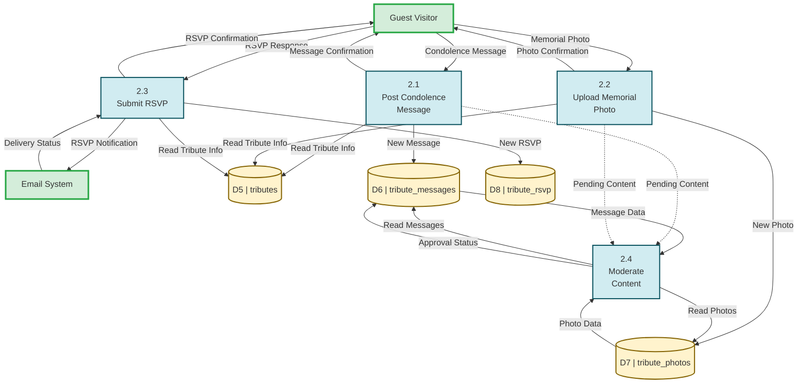
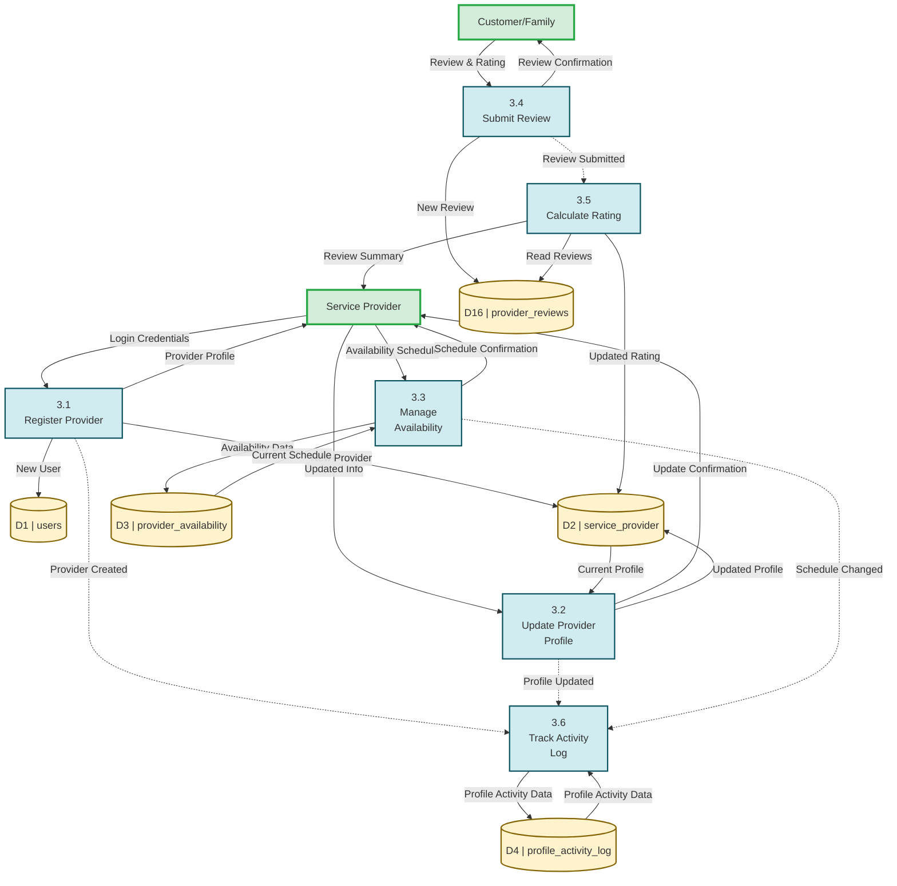
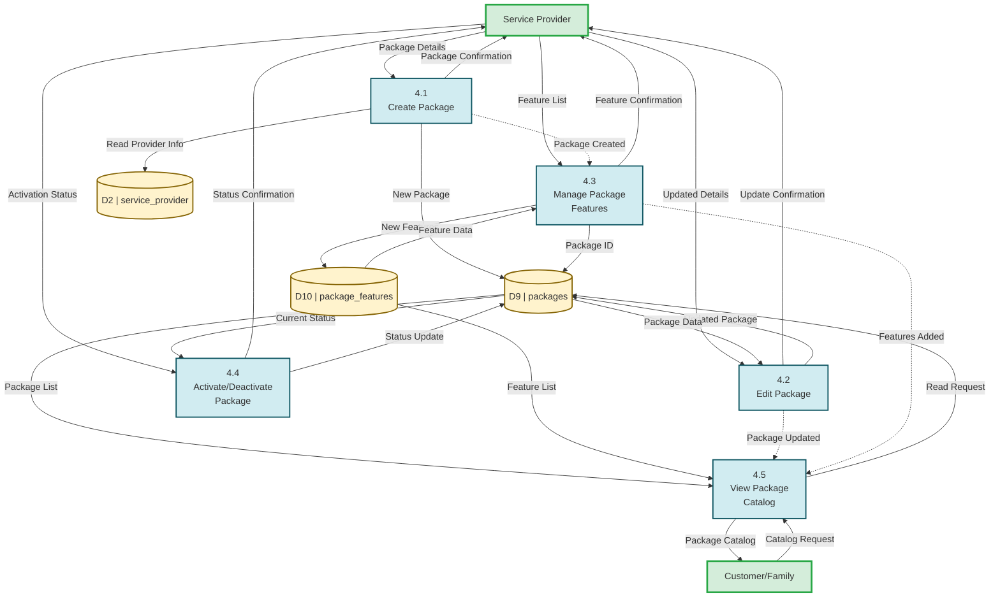
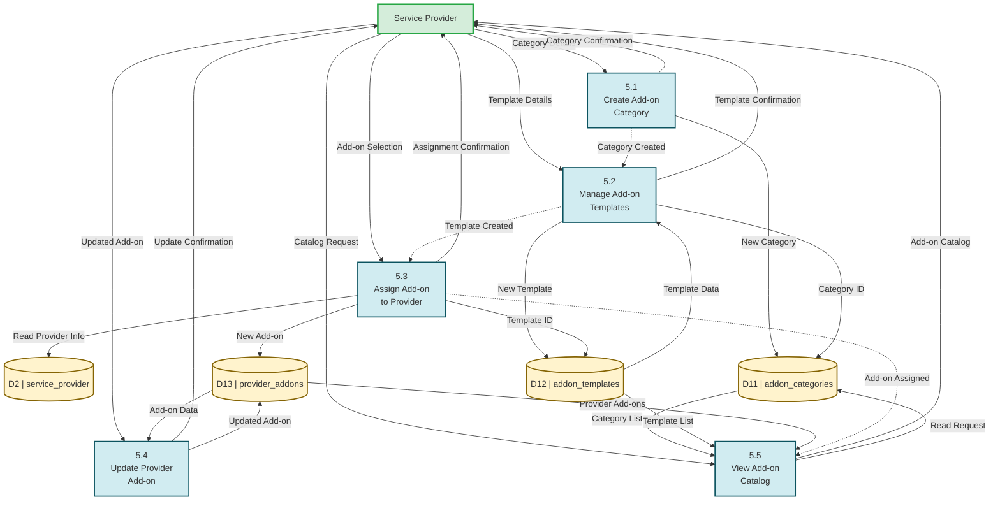
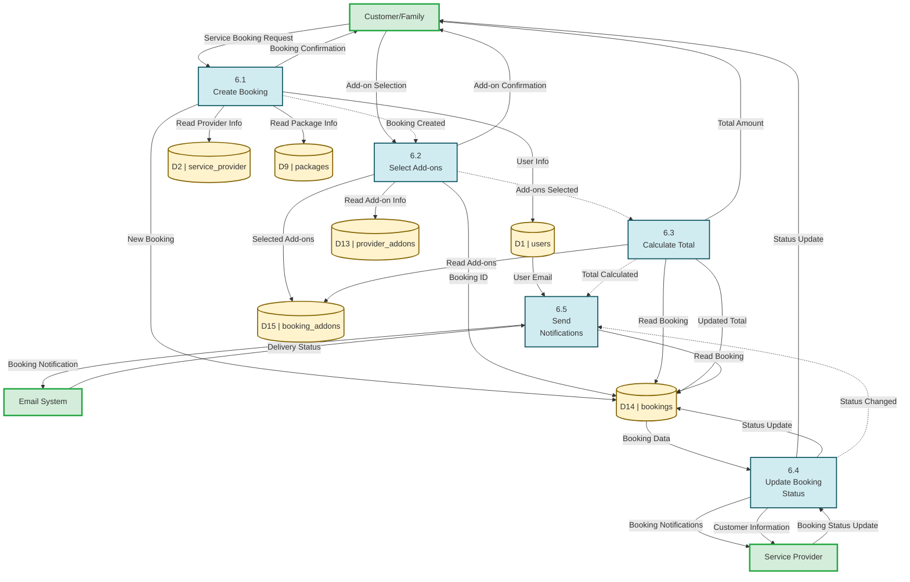
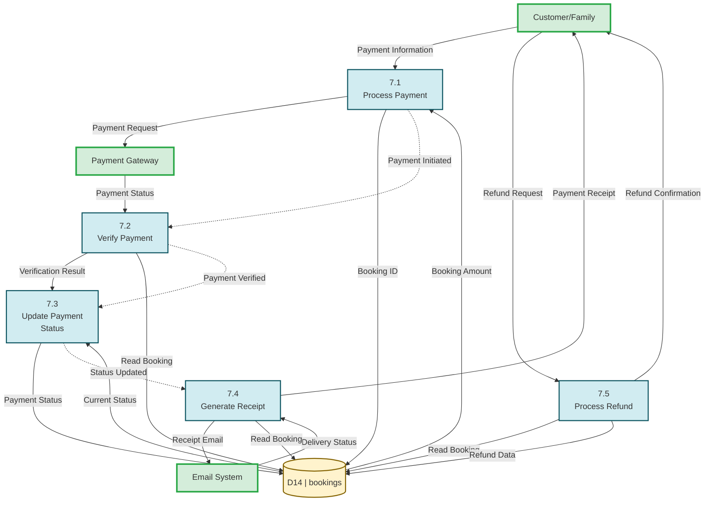

# DFD Level 2 - All Processes Mermaid Code
## Smart Funeral Management System

---

## Process 2.0: Manage Tribute Wall & Interactions



---

## Process 3.0: Manage Service Providers & Reviews



---

## Process 4.0: Manage Service Packages & Features



---

## Process 5.0: Manage Add-on Catalog & Provider Add-ons



---

## Process 6.0: Manage Funeral Service Bookings



---

## Process 7.0: Manage Payments & Refunds



---

## Process 8.0: Manage AI Voice Memorial

```mermaid
flowchart TB
    Guest["Guest Visitor"]
    
    P8_1["8.1<br>Create Voice<br>Model"]
    P8_2["8.2<br>Set Personality<br>Traits"]
    P8_3["8.3<br>Store Memories"]
    P8_4["8.4<br>Configure Chat<br>Settings"]
    P8_5["8.5<br>Process Voice<br>Chat"]
    P8_6["8.6<br>Store<br>Conversation"]
    
    D5[("D5 | tributes")]
    D17[("D17 | voice_models")]
    D18[("D18 | personality_traits")]
    D19[("D19 | memories_database")]
    D20[("D20 | voice_chat_settings")]
    D21[("D21 | voice_conversations")]
    
    %% External to Process
    Guest -- Voice Chat Request --> P8_5
    
    %% Process to External
    P8_5 -- AI Voice Response --> Guest
    
    %% Process to Data Store
    P8_1 -- Read Tribute Info --> D5
    P8_1 -- New Voice Model --> D17
    P8_2 -- Voice Model ID --> D17
    P8_2 -- Trait Data --> D18
    P8_3 -- Read Tribute Info --> D5
    P8_3 -- Memory Data --> D19
    P8_4 -- Voice Model ID --> D17
    P8_4 -- Settings Data --> D20
    P8_5 -- Read Tribute Info --> D5
    P8_5 -- Read Voice Model --> D17
    P8_5 -- Read Traits --> D18
    P8_5 -- Read Memories --> D19
    P8_5 -- Read Settings --> D20
    P8_6 -- Conversation Data --> D21
    
    %% Inter-Process
    P8_1 -. Model Created .-> P8_2
    P8_2 -. Traits Set .-> P8_3
    P8_3 -. Memories Stored .-> P8_4
    P8_4 -. Settings Configured .-> P8_5
    P8_5 -. Chat Completed .-> P8_6
    
    classDef external fill:#d4edda,stroke:#28a745,stroke-width:3px
    classDef process fill:#d1ecf1,stroke:#0c5460,stroke-width:2px
    classDef datastore fill:#fff3cd,stroke:#856404,stroke-width:2px
    
    Guest:::external
    P8_1:::process
    P8_2:::process
    P8_3:::process
    P8_4:::phow should i fix my process rocess
    P8_5:::process
    P8_6:::process
    D5:::datastore
    D17:::datastore
    D18:::datastore
    D19:::datastore
    D20:::datastore
    D21:::datastore
```

---

## Summary

✅ **Process 1.0** - Already created in separate file  
✅ **Process 2.0** - 4 sub-processes (Tribute Wall & Interactions) - **Candle feature removed**  
✅ **Process 3.0** - 6 sub-processes (Service Providers & Reviews) - **Includes D4!**  
✅ **Process 4.0** - 5 sub-processes (Packages & Features)  
✅ **Process 5.0** - 5 sub-processes (Add-on Catalog)  
✅ **Process 6.0** - 5 sub-processes (Bookings)  
✅ **Process 7.0** - 5 sub-processes (Payments & Refunds)  
✅ **Process 8.0** - 6 sub-processes (AI Voice Memorial)  

**Total: 41 sub-processes across 8 DFD Level 2 diagrams**

All diagrams are validated against DFD Level 1 for consistency in:
- External entities
- Data stores
- Data flow labels
- Color coding
- Naming conventions
