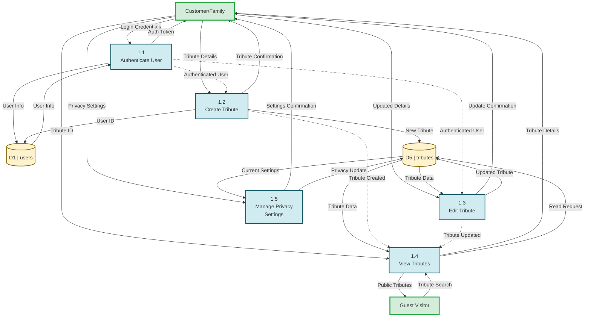

```mermaid
flowchart TB
    Customer["Customer/Family"]
    Guest["Guest Visitor"]
    
    P1_1["1.1<br>Authenticate User"]
    P1_2["1.2<br>Create Tribute"]
    P1_3["1.3<br>Edit Tribute"]
    P1_4["1.4<br>View Tributes"]
    P1_5["1.5<br>Manage Privacy<br>Settings"]
    
    D1[("D1 | users")]
    D5[("D5 | tributes")]
    
    %% External to Process
    Customer -- Login Credentials --> P1_1
    Customer -- Tribute Details --> P1_2
    Customer -- Updated Details --> P1_3
    Customer -- Tribute ID --> P1_4
    Customer -- Privacy Settings --> P1_5
    Guest -- Tribute Search --> P1_4
    
    %% Process to External
    P1_1 -- Auth Token --> Customer
    P1_2 -- Tribute Confirmation --> Customer
    P1_3 -- Update Confirmation --> Customer
    P1_4 -- Public Tributes --> Guest
    P1_4 -- Tribute Details --> Customer
    P1_5 -- Settings Confirmation --> Customer
    
    %% Process to Data Store
    P1_1 -- User Info --> D1
    D1 -- User Info --> P1_1
    P1_2 -- New Tribute --> D5
    P1_2 -- User ID --> D1
    P1_3 -- Updated Tribute --> D5
    D5 -- Tribute Data --> P1_3
    P1_4 -- Read Request --> D5
    D5 -- Tribute Data --> P1_4
    P1_5 -- Privacy Update --> D5
    D5 -- Current Settings --> P1_5
    
    %% Inter-Process
    P1_1 -. Authenticated User .-> P1_2
    P1_1 -. Authenticated User .-> P1_3
    P1_2 -. Tribute Created .-> P1_4
    P1_3 -. Tribute Updated .-> P1_4
    
    classDef external fill:#d4edda,stroke:#28a745,stroke-width:3px
    classDef process fill:#d1ecf1,stroke:#0c5460,stroke-width:2px
    classDef datastore fill:#fff3cd,stroke:#856404,stroke-width:2px
    
    Customer:::external
    Guest:::external
    P1_1:::process
    P1_2:::process
    P1_3:::process
    P1_4:::process
    P1_5:::process
    D1:::datastore
    D5:::datastore
```
